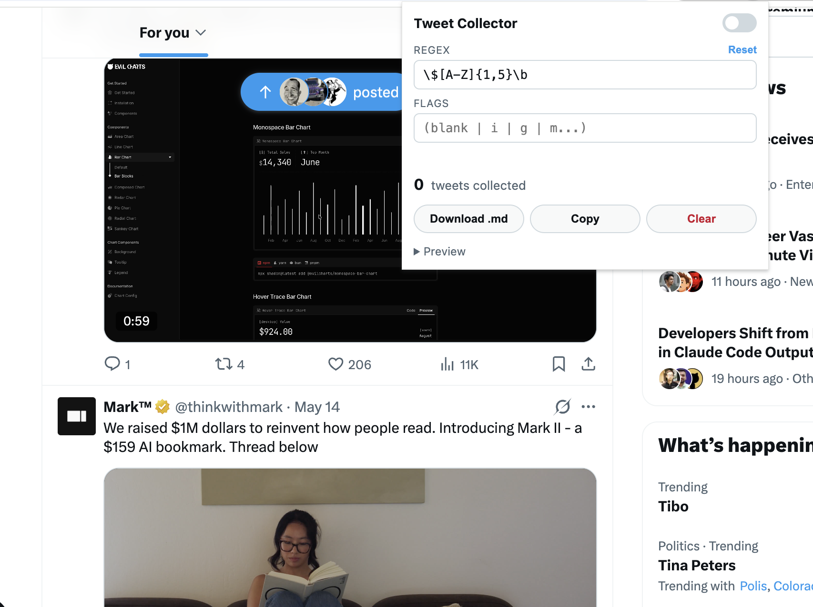

# Tweet Collector

A Chrome extension that saves tweets you scroll past on **x.com** / **twitter.com** when their text matches a regex you set — but only while you've explicitly toggled it on. Flip it off and it goes back to doing nothing. Export the collection as Markdown, ready to drop into your favorite AI agent (Claude, ChatGPT, etc.) for summarising, clustering, sentiment, or whatever analysis you want to run.

It makes **no network requests of its own** — it only reads what is already rendered in the page DOM. Nothing leaves your browser until you choose to share the export.



## Why

Scrolling X is fast; pulling structured data out of it is slow. This extension lets you set a topic filter (any regex), browse normally, and end up with a clean Markdown file of every relevant tweet you saw — author, timestamp, URL, quote tweets, and thread context all preserved. Hand that file to an LLM and you can ask things like "summarise the week in $NVDA chatter" or "group these by stance" without scraping or copy-pasting.

## Install (unpacked)

1. Clone or download this repo.
2. Open `chrome://extensions` in Chrome.
3. Toggle **Developer mode** on (top right).
4. Click **Load unpacked** and select the project folder.
5. Pin the extension to the toolbar.

## Use

1. Click the extension icon to open the popup.
2. Enter a regex and (optionally) flags. The default pattern `\$[A-Z]{1,5}\b` matches stock tickers like `$AAPL`.
3. Flip the toggle on.
4. Browse x.com normally. Any tweet that scrolls into view (≥25% visible) and whose body matches the regex is saved.
5. Open the popup any time to **Download .md**, **Copy** to clipboard, or **Clear**.

## What gets captured

For each matched tweet:

- Display name, handle, ISO timestamp, tweet URL
- Tweet text (with image alt text inlined)
- Quote tweet, if present, nested as a Markdown blockquote
- "Replying to @handle" context, if shown

### Thread expansion

Once a tweet has matched, the extension treats its **entire conversation as in-scope**. If you later open that tweet's thread page, sibling replies in the same conversation are collected too — even if those replies don't match the regex. This is intentional: matching one tweet usually means you care about the whole thread.

Replies you scroll past in the timeline (not on a thread page) are only saved if they match the regex on their own.

## Output format

```markdown
# Collected Tweets

## Thread — https://x.com/user/status/123

- **Display Name @user** · 2026-05-07T12:00:00.000Z
  Root tweet body...

  > **Quoting Other Name @other** · 2026-05-06T...
  > Quoted body...

  [view](https://x.com/user/status/123)

  - **Replier @rep** · 2026-05-07T12:05:00.000Z
    _Replying to @user_
    Reply body...
```

Threads are sorted by when you first collected them; tweets within a thread are sorted chronologically.

## Storage

Everything lives in `chrome.storage.local` under two keys:

- `tc_settings` — `{ enabled, pattern, flags }`
- `tc_tweets` — map of `tweetId → tweet`

To wipe state, use the **Clear** button in the popup, or remove the extension.

## Limitations

- Detection is purely DOM-based. Tweets that are virtualised away before they render aren't captured — by design, since the extension never fetches anything itself.
- "Replying to which exact tweet" isn't exposed in X's rendered DOM, so threading uses the conversation URL. Replies outside a thread page are listed standalone with the `Replying to @handle` label preserved.
- X's DOM changes occasionally; the selectors (`article[data-testid="tweet"]`, `[data-testid="tweetText"]`, `[data-testid="User-Name"]`, `time`) may need updating if X reshuffles them.

## Project layout

```
manifest.json       Chrome MV3 manifest
src/
  content.js       Runs on x.com — observes articles, parses, saves
  popup.html       Toolbar popup UI
  popup.css
  popup.js         Settings + Markdown rendering + export
```

## Permissions

- `storage` — to keep settings and collected tweets locally
- `downloads` — to save the Markdown export
- Host access to `x.com` and `twitter.com` only

No other permissions, no background workers, no remote endpoints.
